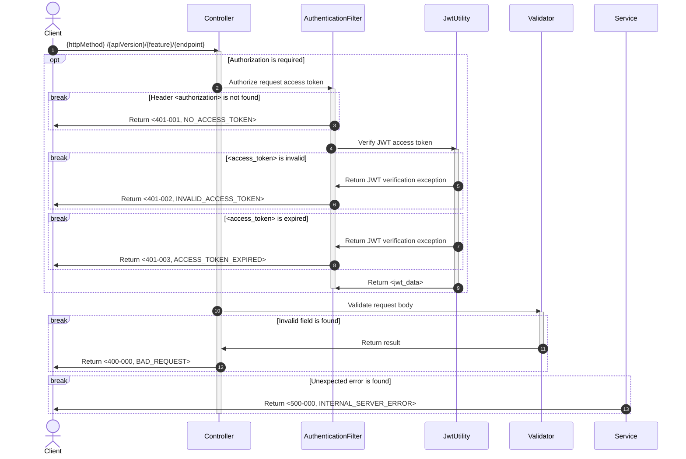
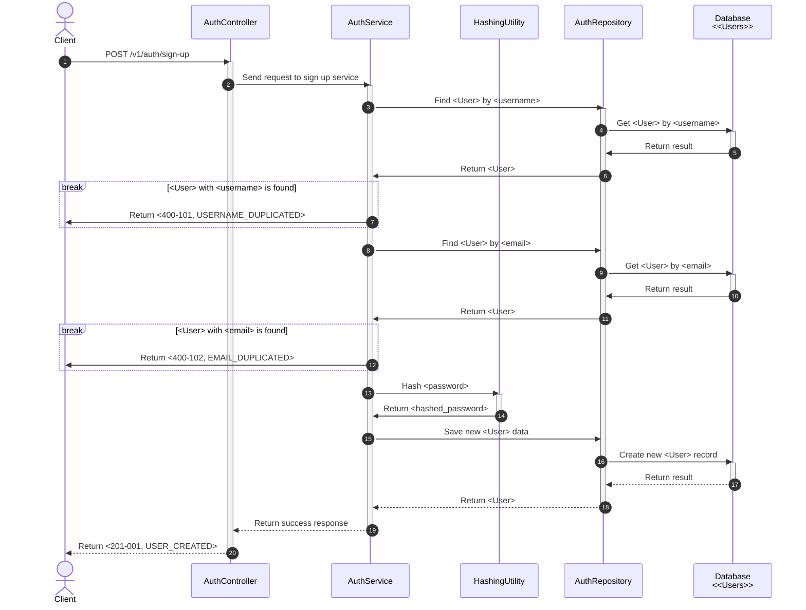

# Sequence Diagram

A collection of sequence diagrams for all modules in the Trip Together application, illustrating the interactions and
processes within each API.

## Table of Contents

- [Base Sequence](#base-sequence)
- [Module 1 - User Management](#module-1---user-management)
    - [Module 1.1 - Authentication](#module-11---authentication)

---

## Base Sequence

- Base sequence is the required sequences which are included in all sequence diagrams.

## Module 1 - User Management

### Module 1.1 - Authentication

- **Sign Up**: Sign up a new user in the system.

---