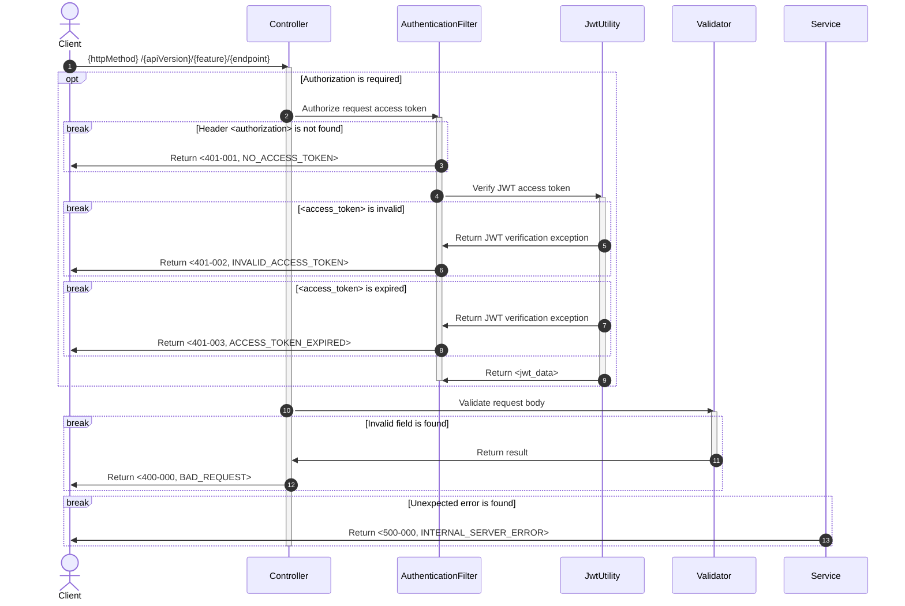

# Sequence Diagram

A collection of sequence diagrams for all modules in the Trip Together application, illustrating the interactions and
processes within each API.

## Table of Contents

- [Base Sequence](#base-sequence)

---

## Base Sequence

- Base sequence is the required sequences which are included in all sequence diagrams.

---